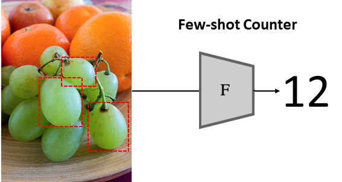
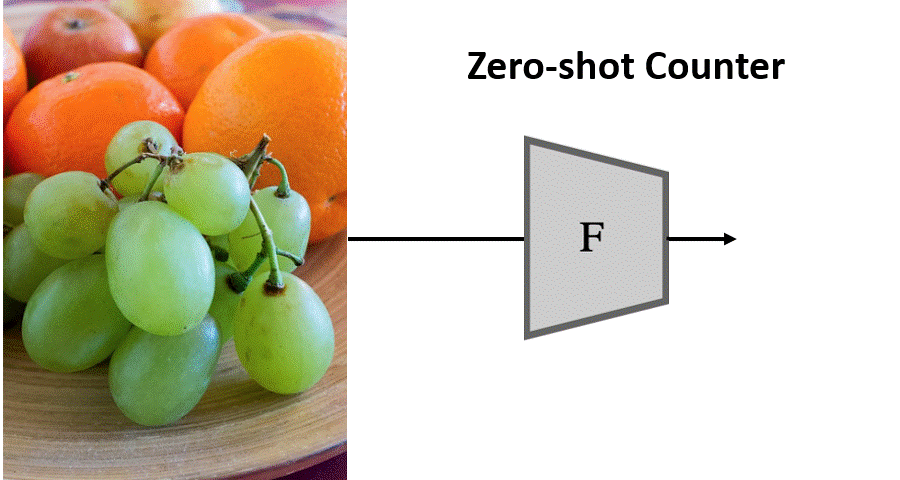
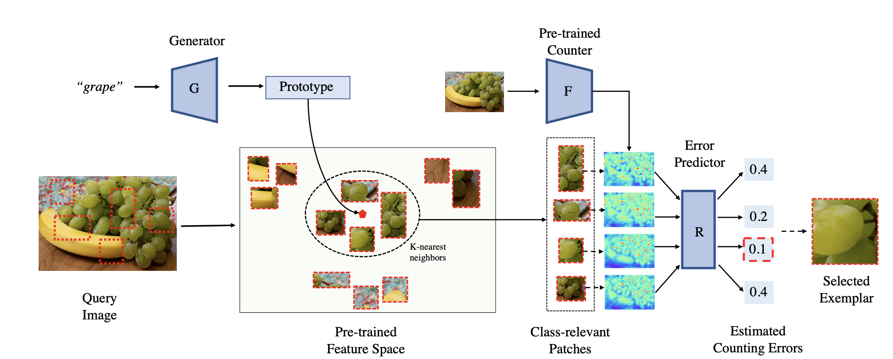

# [CVPR 2023] Zero-Shot Object Counting


## Counting without human annotated exemplars

<div style="display: flex;">
  <div style="flex: 0 0 300px;">
    
  </div>
  <div style="flex: 0 0 100px;"></div>
  <div style="flex: 0 0 300px;">
    
  </div>
</div>
<div style="display: flex;">
  <div style="flex: 0 0 300px;">
    <p>(a) Few-shot Counting </p>
  </div>
  <div style="flex: 0 0 100px;"></div>
  <div style="flex: 0 0 300px;">
    <p>(a) Zero-shot Counting (ours) </p>
  </div>
</div>


## Overview
This repository contains the implementation of the paper [**Zero-Shot Object Counting**](https://arxiv.org/abs/2303.02001). 
We propose zero-shot object counting (ZSC), a new setting where only the class name is available during test time. Such a counting system does not require human annotators in the loop and can operate automatically. Starting from a class name, we propose a method that can accurately identify the optimal patches which can then be used as counting exemplars. We first construct a class prototype to select the patches that are likely to contain the objects of interest and then we train a model to quantitatively measure how suitable an arbitrary patch is as a counting exemplar. By applying this model to all the candidate patches, we can select the most suitable patches as exemplars for counting.

 


## Installation


## Training


## Testing

## Citation
Please cite our CVPR 2022 paper:
```
@InProceedings{Xu_2023_CVPR,
    author    = {Xu, Jingyi and Le, Hieu and Nguyen, Vu and Ranjan, Viresh and Samaras, Dimitris},
    title     = {Zero-Shot Object Counting},
    booktitle = {Proceedings of the IEEE/CVF Conference on Computer Vision and Pattern Recognition (CVPR)},
    month     = {June},
    year      = {2023},
    pages     = {15548-15557}
}
```

## Acknowledgment
This research was partially supported by NSF grants IIS-2123920 and IIS-2212046 and the NASA Biodiversity program (Award 80NSSC21K1027).
